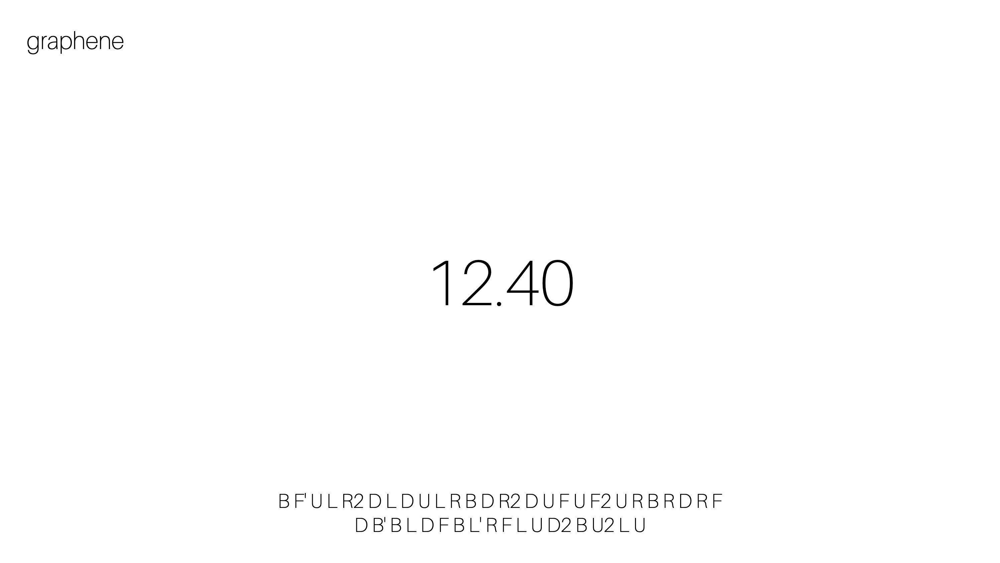

# graphene

Graphene is a minimalist, self-hostable, no-nonsense speedcubing timer that respects your privacy. No invasive tracking or analytics.

Powered by Vue.js, currently a work in progress.

Credit to [cubing](https://js.cubing.net/cubing/) for the scramble library.
